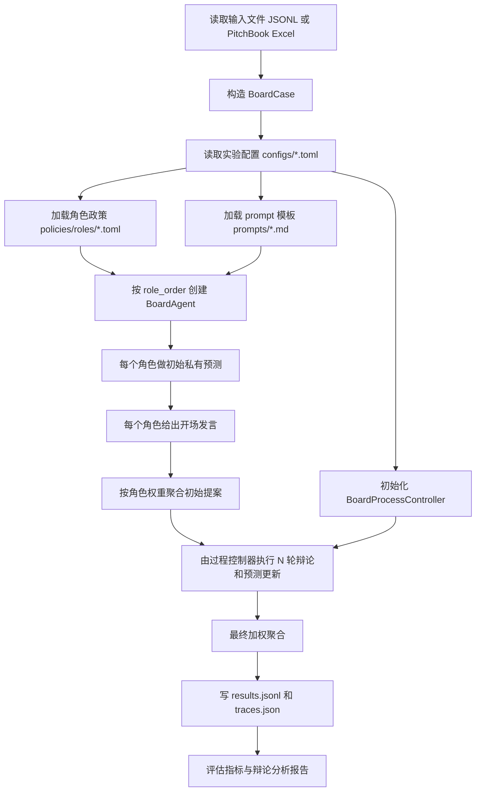

# 实验流程

## 实验目标

本实验模拟创业公司在真实 VC 交易发生前的董事会决策。每个角色只能看到决策时点之前允许可见的信息，并基于自身角色政策预测下一次融资结果。

预测目标包括：

- `financing_intent`：`raise_now`、`wait`、`avoid`
- `completion_view`：`likely_complete`、`unlikely_complete`
- `predicted_deal_size_usd_m`
- `predicted_post_money_valuation_usd_m`
- `predicted_investor_ownership_pct`
- `predicted_deal_type`
- `valuation_direction`：`up`、`flat`、`down`

真实标签保存在 `notes.labels` 中，只用于评估，不提供给 Agent。

## 人类可读流程

## 详细阶段

### 1. 输入读取

入口：

- 单次运行：`run_experiment.py`
- 批量运行：`run_batch_experiments.py`

支持两类输入：

- 标准化 JSONL：每行一个 `BoardCase`。
- PitchBook Excel：由 `boardroom_sim/pitchbook.py` 转换成 `BoardCase`。

历史窗口由 `history_limit` 控制：

- `10`：每个历史列表最多保留最近 10 条。
- `0`：不提供历史列表。
- `-1`：保留全部可构造历史记录。

### 2. 配置读取

`load_experiment_config()` 默认读取 `configs/boardroom_default.toml`。配置决定：

- 实验名
- 角色政策目录
- prompt 目录
- 角色发言顺序
- 角色聚合权重
- 辩论轮次
- 历史窗口
- 讨论范式
- 发言风格模块
- 决策协议
- 每轮辩论任务
- 董事会 archetype 及其默认 L5 文化层、讨论 protocol、主导模式、挑战要求、历史可见范围和角色权重乘数

命令行参数 `--config` 可以指定其它 TOML 文件。`--bargaining-rounds` 和 `--history-limit` 会覆盖配置值。

### 3. 角色政策加载

`build_role_policies()` 从 `policies/roles/*.toml` 读取角色政策。每个角色包含四层：

- L1：目标函数
- L2：可见字段和忽略字段
- L3：启发式判断规则
- L4：交互协议

最重要的是 `layer_2_attention_fields`。Agent 只能看到这里列出的字段。

### 4. 初始私有预测

每个角色按 `agents.role_order` 依次调用 LLM。

输入包括：

- system prompt
- 角色四层政策
- 该角色可见字段
- 最小共享案例元数据
- 此前已发言角色的预测上下文

输出必须是 JSON。代码会把 LLM 输出转成 `RoleDecision`，并校验枚举、数值范围和默认值。

### 5. 开场发言

每个角色用自己的初始 `RoleDecision` 生成一段简短开场陈述。这一步不再调用 LLM，只用于 trace。

### 6. 初始聚合提案

`BoardroomSimulator._build_proposal()` 根据当前所有角色预测生成聚合提案。

分类字段使用加权众数，数值字段使用加权平均。权重来自 `configs/boardroom_default.toml` 的 `[decision.weights]`。

### 7. 辩论与预测更新

每轮按角色顺序逐个发言。每个角色看到：

- 自己当前预测
- 当前聚合提案
- 其它角色当前预测
- 此前辩论消息
- 本轮任务
- 配置选择的 response generator
- 当前董事会过程约束，包括 board archetype、board_archetype_description、L5 culture、discussion protocol、challenge_required、memory_scope 和当前有效权重

LLM 必须返回：

- 一到三句董事会发言 `message`
- 更新后的完整预测 JSON

如果预测没有变化，`rationale` 里应包含 `update_status: no_change`。如果预测变化，应包含 `update_status: changed_fields=...`。

当前过程控制器支持的最小 protocol：

- `chair_gated`：保持配置中的固定发言顺序。
- `free_interjection`：每轮轮换发言顺序，模拟更开放的插话式讨论。
- `top3_dominance`：只让有效权重最高的前三位角色发言，模拟少数强势董事主导。
- `rubber_stamp`：只在第一轮让 Founder CEO 和 Lead VC 做短讨论，后续轮次不再发言。

### 8. 最终聚合

辩论轮次结束后，模拟器按“基础权重 × archetype profile 中的角色权重乘数 × 可选配置覆盖”得到的有效权重聚合所有角色最新预测，生成最终 `SimulationResult`。

输出包含：

- compact result：用于评估
- role decisions：每个角色最终预测
- proposal：最终聚合提案
- trace：完整阶段、发言、payload

### 9. 批量实验和评估

`run_batch_experiments.py` 会为每个 run 写：

- `results.jsonl`
- `traces.json`
- `metrics.json`
- `case_metrics.csv`
- `debate_accuracy_report.md`
- `debate_accuracy_cases.csv`
- baseline 结果和 baseline 指标

批量运行默认还会跑两个 baseline：

- `baseline_history_only`：只看历史字段。
- `baseline_history_with_roles`：看历史字段和角色规则，但不模拟多智能体辩论。

## 防泄露规则

- 当前目标交易真实结果只放在 `notes.labels`。
- Agent prompt 中只传入角色可见字段和最小案例元数据。
- `business_status`、`company_financing_status` 等可能泄露后验状态的字段，只有在明确加入角色可见字段时才会出现。
- prompt 中反复强调不得推断或泄露隐藏标签。
