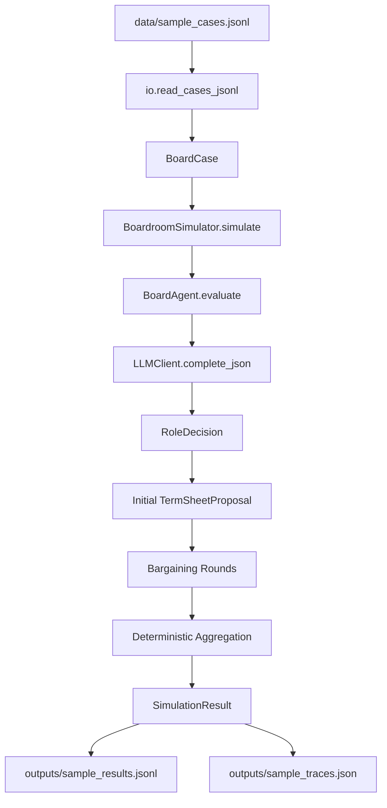

# Boardroom Simulation MVP 项目教程报告

更新时间：2026-04-25

本文档是一份面向学习、复现和后续开发的项目教程。它解释 `boardroom_sim_mvp` 文件夹下每个文件的作用、代码运行链路、核心数据结构、智能体行为逻辑、输入输出格式，以及后续可改进方向。

## 1. 项目一句话概括

本项目是一个最小可运行版本的“多智能体创业公司董事会融资决策模拟器”。

它读取一组创业公司融资案例，让多个董事会角色通过 LLM 生成各自判断和谈判发言，然后用确定性聚合规则输出最终结论。当前只研究三个核心事件：

1. 融资决策：`approve`、`renegotiate`、`reject`
2. 估值方向：`up`、`flat`、`down`、`unknown`
3. CEO 去留：`keep`、`monitor`、`replace`

当前参与模拟的四个角色是：

1. `Founder_CEO`
2. `CTO`
3. `Lead_VC_Director`
4. `Followon_VC_Director`

这些角色都采用四层行为规范：

1. L1 目标函数
2. L2 注意力字段
3. L3 启发式规则
4. L4 交互协议

## 2. 项目目录结构

```text
boardroom_sim_mvp/
├── boardroom_sim/
│   ├── __init__.py
│   ├── agents.py
│   ├── io.py
│   ├── llm.py
│   ├── models.py
│   ├── roles.py
│   └── simulator.py
├── data/
│   └── sample_cases.jsonl
├── input/
│   └── 02_03_pitchbook_sample_100_shared.xlsx
├── outputs/
│   └── .gitkeep
├── .gitignore
├── 260424-智能体角色编定-HZ.pdf
├── PitchBook 样本数据字段字典.md
├── README.md
├── run_experiment.py
└── 调研报告.pdf
```

## 3. 每个文件的作用

| 文件 | 作用 |
|---|---|
| `README.md` | 项目总说明，包含运行命令、环境变量、输入输出示例、当前边界和扩展建议。 |
| `run_experiment.py` | 命令行入口。负责解析参数、创建 LLM 客户端、读取案例、调用模拟器、写出结果。 |
| `boardroom_sim/__init__.py` | Python 包入口。对外暴露 `BoardCase`、`SimulationResult`、`BoardroomSimulator`。 |
| `boardroom_sim/models.py` | 数据模型层。定义案例、角色策略、角色决策、term sheet 提案、最终结果等 dataclass。 |
| `boardroom_sim/roles.py` | 角色策略层。硬编码四个董事会角色的 L1-L4 行为规范。 |
| `boardroom_sim/llm.py` | LLM 调用层。使用标准库请求 OpenAI-compatible Chat Completions 接口，并解析 JSON。 |
| `boardroom_sim/agents.py` | 智能体层。把角色策略、可见字段和上下文拼成 prompt，让 LLM 输出角色判断和谈判发言。 |
| `boardroom_sim/simulator.py` | 模拟引擎层。串联角色发言、提案生成、谈判轮次、最终聚合和 trace 记录。 |
| `boardroom_sim/io.py` | 输入输出层。读取 JSONL 案例，写 compact results JSONL 和 detailed trace JSON。 |
| `data/sample_cases.jsonl` | 3 条最小样例案例。用于验证项目能否跑通。 |
| `outputs/.gitkeep` | 输出目录占位文件。真正生成的结果文件会被 `.gitignore` 忽略。 |
| `input/02_03_pitchbook_sample_100_shared.xlsx` | PitchBook 样本数据工作簿。包含 100 家公司及其行业、人员、投资人、融资交易等关系表。当前代码尚未直接读取它。 |
| `PitchBook 样本数据字段字典.md` | Excel 字段字典，解释每张 sheet 和字段含义，是后续把 PitchBook 转成模拟案例的依据。 |
| `260424-智能体角色编定-HZ.pdf` | 智能体角色设计文档。当前 `roles.py` 已经把该文档中的四层结构转成代码。 |
| `调研报告.pdf` | 调研报告，概述 PitchBook 数据集结构和 DIALECTIC、VCAF、SSFF 等相关多智能体投资研究。 |
| `.gitignore` | 忽略 Python 缓存、虚拟环境、`.env` 和 `outputs/*` 生成结果。 |

## 4. 推荐阅读顺序

如果你要完整理解项目，建议按下面顺序读：

1. `README.md`
2. `run_experiment.py`
3. `boardroom_sim/io.py`
4. `boardroom_sim/models.py`
5. `boardroom_sim/roles.py`
6. `boardroom_sim/agents.py`
7. `boardroom_sim/llm.py`
8. `boardroom_sim/simulator.py`
9. `data/sample_cases.jsonl`
10. `PitchBook 样本数据字段字典.md`
11. `input/02_03_pitchbook_sample_100_shared.xlsx`
12. 两份 PDF 背景材料

这个顺序的好处是：先理解“怎么跑”，再理解“数据长什么样”，最后理解“智能体如何决策”。

## 5. 如何运行项目

项目运行依赖一个 OpenAI-compatible Chat Completions 服务。可以是 OpenAI，也可以是 DeepSeek、OpenRouter、硅基流动等兼容接口。

先进入项目目录：

```bash
cd /data/miracle089757/boardroom_sim_mvp
```

设置环境变量：

```bash
export BOARDROOM_LLM_API_KEY="your_api_key"
export BOARDROOM_LLM_BASE_URL="https://api.z.ai/api/paas/v4"
export BOARDROOM_LLM_MODEL="glm-4.7-flash"
```

运行样例：

```bash
python3 run_experiment.py \
  --input data/sample_cases.jsonl \
  --output outputs/sample_results.jsonl \
  --trace-output outputs/sample_traces.json
```

也可以在命令行覆盖模型配置：

```bash
python3 run_experiment.py \
  --input data/sample_cases.jsonl \
  --output outputs/sample_results.jsonl \
  --trace-output outputs/sample_traces.json \
  --model glm-4.7-flash \
  --base-url https://api.z.ai/api/paas/v4 \
  --temperature 0.2
```

默认每个案例会调用 LLM：

```text
4 次私有判断 + 4 * bargaining_rounds 次谈判发言
```

默认 `bargaining_rounds=2`，所以每个案例是：

```text
4 + 4 * 2 = 12 次 LLM 调用
```

样例文件有 3 条案例，默认总共约 36 次 LLM 调用。

## 6. 总体运行链路

整体数据流如下：



更具体地说：

1. `run_experiment.py` 解析命令行参数。
2. `LLMConfig.from_env()` 从环境变量和 CLI 参数构造 LLM 配置。
3. `read_cases_jsonl()` 读取每一行 JSON，并转成 `BoardCase`。
4. `BoardroomSimulator` 初始化四个角色策略和四个智能体。
5. 每个角色按固定顺序进行私有评估。
6. 每个角色生成开场陈述。
7. 系统根据 Lead VC 的判断生成初始 term sheet 提案。
8. 进入若干轮谈判，每个角色生成一句或几句谈判发言。
9. 模拟器用确定性规则聚合最终融资、估值和 CEO 结论。
10. 结果写入 compact JSONL，完整过程写入 trace JSON。

## 7. 入口文件：run_experiment.py

`run_experiment.py` 是整个项目的命令行入口。它做三件事：

1. 解析参数
2. 创建 LLM 客户端
3. 批量运行模拟并写出结果

核心函数：

```python
def parse_args() -> argparse.Namespace:
    ...

def run_experiment(input_path: Path, bargaining_rounds: int, llm_client: LLMClient) -> List[SimulationResult]:
    ...

def main() -> None:
    ...
```

参数说明：

| 参数 | 含义 |
|---|---|
| `--input` | 输入 JSONL 案例路径。 |
| `--output` | compact 结果 JSONL 输出路径。 |
| `--trace-output` | detailed trace JSON 输出路径。 |
| `--bargaining-rounds` | 谈判轮数，默认 2。 |
| `--api-key-env` | API key 所在环境变量名，默认 `BOARDROOM_LLM_API_KEY`。 |
| `--model` | 模型名，可覆盖环境变量。 |
| `--base-url` | OpenAI-compatible base URL，可覆盖环境变量。 |
| `--temperature` | LLM temperature。 |
| `--timeout-seconds` | HTTP 请求超时时间。 |

## 8. 数据模型：models.py

`models.py` 是项目的数据结构中心。理解它，就能理解项目内部流动的对象。

### 8.1 枚举类型

```python
FinancingVote = Literal["approve", "renegotiate", "reject"]
ValuationDirection = Literal["up", "flat", "down", "unknown"]
CeoReplacementView = Literal["keep", "monitor", "replace"]
```

这三个类型对应项目当前研究的三个核心事件。

### 8.2 BoardCase

`BoardCase` 表示一个融资案例。它包含：

| 字段类型 | 示例 |
|---|---|
| 公司基本信息 | `case_id`、`company_name`、`industry`、`round_type` |
| 融资信息 | `deal_size_usd_m`、`pre_money_valuation_usd_m`、`post_money_valuation_usd_m` |
| 历史估值 | `previous_post_money_valuation_usd_m` |
| 经营压力 | `runway_months`、`burn_multiple` |
| 创始人控制权 | `founder_equity_pct` |
| 团队与技术 | `employee_growth_rate`、`engineering_headcount_growth_rate`、`tech_debt_risk` |
| CEO 风险 | `ceo_performance_risk`、`ceo_technical_alignment` |
| 投资人信号 | `lead_investor_reputation`、`lead_investor_conviction`、`followon_fund_capacity` |
| 市场与状态 | `market_temperature`、`business_status` |

它还提供三个辅助方法：

```python
implied_dilution_pct()
valuation_markup()
observed_valuation_direction()
```

其中 `implied_dilution_pct()` 用交易金额除以投后估值估算稀释比例：

```text
deal_size_usd_m / post_money_valuation_usd_m * 100
```

### 8.3 RolePolicy

`RolePolicy` 表示一个角色的四层行为规范：

```python
role_name
layer_1_goals
layer_2_attention_fields
layer_2_ignored_fields
layer_3_heuristics
layer_4_interaction_protocol
```

这是连接“角色设计文档”和“LLM prompt”的核心对象。

### 8.4 RoleDecision

`RoleDecision` 是某个角色对当前案例的判断：

```python
role_name
financing_vote
valuation_direction
ceo_replacement_view
satisfaction_score
rationale
observed_fields
```

注意：`observed_fields` 只包含该角色在 L2 中允许关注的字段。这是项目模拟“有限注意力”和“角色视角差异”的关键设计。

### 8.5 TermSheetProposal

`TermSheetProposal` 表示当前谈判使用的最小 term sheet：

```python
deal_size_usd_m
valuation_direction
implied_dilution_pct
investor_protection_level
tech_budget_protected
ceo_milestones_required
```

它不是完整法律意义上的 term sheet，只是模拟中用于推动谈判的简化提案。

### 8.6 SimulationResult

`SimulationResult` 是一个案例的最终输出：

```python
case_id
company_name
financing_decision
valuation_direction
ceo_replacement_decision
role_decisions
proposal
consensus_score
deal_break_risk
governance_conflict_risk
trace
```

其中 `trace` 是完整过程记录，适合调试和研究。

## 9. 角色策略：roles.py

`roles.py` 把四个董事会角色写成代码。

### 9.1 Founder_CEO

核心目标：

1. 最大化长期公司价值。
2. 保留创始人控制权。
3. 避免过度稀释。
4. 维持融资后的执行自由。

关注字段包括：

```text
deal_size_usd_m
pre_money_valuation_usd_m
post_money_valuation_usd_m
previous_post_money_valuation_usd_m
round_type
founder_equity_pct
runway_months
employee_growth_rate
```

行为倾向：

1. 控制权红线优先。
2. 估值上升是市场信号。
3. 如果融资显著改善 runway，可以接受一定稀释。
4. 公开表达后的承诺较难改变。

### 9.2 CTO

核心目标：

1. 保护工程团队健康。
2. 保护技术可行性。
3. 保护架构质量和个人技术声誉。

关注字段包括：

```text
engineering_headcount_growth_rate
employee_growth_rate
tech_debt_risk
ceo_technical_alignment
industry
runway_months
```

行为倾向：

1. 反对工程团队收缩。
2. 反对不现实的技术承诺。
3. 优先保护技术预算。
4. 要求融资叙事与技术前提匹配。

### 9.3 Lead_VC_Director

核心目标：

1. 最大化退出倍数。
2. 争取有利融资条款。
3. 保护组合账面价值和下行风险。

关注字段包括：

```text
post_money_valuation_usd_m
previous_post_money_valuation_usd_m
deal_size_usd_m
burn_multiple
runway_months
lead_investor_conviction
lead_investor_reputation
ceo_performance_risk
```

行为倾向：

1. 下行保护优先于未定价上行。
2. 估值要匹配增长和 burn 风险。
3. 执行风险高时保留管理层调整权。
4. 对 term sheet 有较强影响力。

### 9.4 Followon_VC_Director

核心目标：

1. 保护 pro-rata 权利。
2. 维护投资 IRR。
3. 借助 lead investor 信号，同时管理组合分散度。

关注字段包括：

```text
deal_size_usd_m
lead_investor_reputation
lead_investor_conviction
post_money_valuation_usd_m
previous_post_money_valuation_usd_m
followon_fund_capacity
```

行为倾向：

1. 默认愿意跟投，除非出现明显红旗。
2. 保护 pro-rata 和反稀释位置。
3. 参考 Lead VC，但不完全替代 Lead VC 判断。
4. 基金容量约束会影响参与程度。

## 10. LLM 客户端：llm.py

`llm.py` 没有使用 OpenAI 官方 SDK，而是只用 Python 标准库：

```python
urllib.request
urllib.error
json
os
re
```

这样做的好处是依赖少，MVP 容易跑。代价是功能比较基础，例如没有 streaming、并发、自动 backoff、高级错误类型。

### 10.1 LLMConfig

`LLMConfig` 保存：

```python
api_key
model
base_url
temperature
timeout_seconds
```

`from_env()` 会读取：

```text
BOARDROOM_LLM_API_KEY
BOARDROOM_LLM_MODEL
BOARDROOM_LLM_BASE_URL
BOARDROOM_LLM_TEMPERATURE
BOARDROOM_LLM_TIMEOUT_SECONDS
```

其中 API key 是必需的。如果缺失，程序会直接报错。

### 10.2 LLMClient.complete_text

这个方法向：

```text
{base_url}/chat/completions
```

发送 POST 请求。payload 结构是：

```json
{
  "model": "...",
  "messages": [...],
  "temperature": 0.2
}
```

返回值是 assistant message 的 `content`。

### 10.3 LLMClient.complete_json

智能体要求 LLM 返回 JSON。`complete_json()` 会：

1. 调用 `complete_text()`
2. 尝试从文本里提取 JSON object
3. 如果失败，会把失败回答追加进上下文，并要求模型重新输出 JSON
4. 默认最多重试 2 次

### 10.4 extract_json_object

这个函数支持两种常见 LLM 输出：

```json
{"key": "value"}
```

以及 fenced code block：

```text
```json
{"key": "value"}
```
```

如果模型输出混有解释文字，它会用正则尝试抽取第一个 JSON object。

## 11. 智能体逻辑：agents.py

`agents.py` 是 LLM 角色行为的核心文件。

### 11.1 BoardAgent.observe

```python
def observe(self, case: BoardCase) -> Dict[str, Any]:
    case_dict = case.to_dict()
    return {field: case_dict.get(field) for field in self.policy.layer_2_attention_fields}
```

这个方法只返回角色 L2 attention fields 中列出的字段。

例如 CTO 看不到投资人偏好细节，Follow-on VC 也看不到技术债字段。这让不同角色拥有不同信息视角。

### 11.2 BoardAgent.evaluate

`evaluate()` 会构造 system prompt 和 user prompt，让 LLM 输出：

```json
{
  "financing_vote": "approve|renegotiate|reject",
  "valuation_direction": "up|flat|down|unknown",
  "ceo_replacement_view": "keep|monitor|replace",
  "satisfaction_score": 0,
  "rationale": ["short reason 1", "short reason 2"]
}
```

输入 prompt 包含：

1. 当前角色名
2. 四层角色策略
3. 该角色可见字段
4. 最小共享案例元数据
5. 已经发言角色的上下文
6. 允许的输出标签

### 11.3 BoardAgent.opening_statement

根据已经得到的 `RoleDecision` 生成一个简短开场陈述：

```text
Founder_CEO starts with financing=..., valuation=..., ceo=...
```

这个方法不再调用 LLM。

### 11.4 BoardAgent.bargaining_message

谈判轮次中，每个角色再次调用 LLM，基于当前提案和自己的立场生成一句到三句发言。

prompt 要求它：

1. 只讨论融资、估值或 CEO 去留。
2. 体现 L1-L4 角色规范。
3. 避免泛泛的公司口号。
4. 返回 JSON：

```json
{
  "message": "your boardroom message"
}
```

### 11.5 LLM 输出规整

`agents.py` 里有几个防御函数：

```python
coerce_choice()
coerce_float()
coerce_rationale()
clamp_score()
```

它们解决的问题是：即使 prompt 要求严格 JSON，LLM 仍可能输出大小写不同、空格、非法值或奇怪分数。

例如：

```text
"re-negotiate" -> "renegotiate"
"Monitor" -> "monitor"
120 -> 100
```

## 12. 模拟引擎：simulator.py

`simulator.py` 控制整个董事会流程。

### 12.1 BoardroomSimulator 初始化

初始化时会：

1. 保存谈判轮数。
2. 调用 `build_role_policies()` 生成四个角色策略。
3. 调用 `build_agents()` 为每个策略创建智能体。
4. 固定发言顺序：

```python
["Founder_CEO", "CTO", "Lead_VC_Director", "Followon_VC_Director"]
```

### 12.2 simulate() 主流程

`simulate()` 是单个案例的完整模拟过程：

```text
preliminary
role_policy
private_assessment * 4
opening_statement * 4
initial_proposal
bargaining_round_1 * 4
bargaining_round_2 * 4
closure
```

每一步都会写入 `trace`。

### 12.3 初始提案生成

`_build_initial_proposal()` 根据 Lead VC 的立场生成简化 term sheet。

规则大致是：

1. 如果 Lead VC 拒绝融资，或要求 monitor/replace CEO，则 investor protection 为 `strong`。
2. 如果 Lead VC approve 且估值方向为 up，则 protection 为 `light`。
3. 其他情况为 `standard`。
4. 如果工程 headcount 非负且技术债风险低于 0.75，则保护技术预算。
5. 如果 Lead VC 要求 monitor/replace CEO，则要求 CEO milestones。

### 12.4 融资决策聚合

`_aggregate_financing()` 的规则：

```text
如果 Founder CEO 或 Lead VC 任一方 reject -> reject
否则如果 Founder CEO、Lead VC、CTO 中任一方 renegotiate，或 CTO reject -> renegotiate
否则 -> approve
```

这反映了两个假设：

1. Founder CEO 和 Lead VC 对交易是否成行有强阻断力。
2. CTO 虽然不一定有正式投票权，但技术反对会推动重新谈判。

### 12.5 估值方向聚合

`_aggregate_valuation()` 使用加权投票：

```python
weights = {
    "Founder_CEO": 2.0,
    "CTO": 0.5,
    "Lead_VC_Director": 3.0,
    "Followon_VC_Director": 1.5,
}
```

Lead VC 权重最高，CTO 权重最低。这符合当前模拟中“估值主要由融资双方决定，技术角色影响较弱”的假设。

### 12.6 CEO 去留聚合

`_aggregate_ceo_replacement()` 的核心逻辑：

1. 如果 Lead VC 要求 replace，且 Follow-on VC 支持 replace/monitor，或 CEO 风险极高，则可能 replace。
2. 如果 CTO 不支持 keep，或 CEO 风险极高，则 replace 更容易成立。
3. 如果 investor 或 CTO 至少要求 monitor，则结果为 monitor。
4. 否则 keep。

这表示 CEO 更换需要较强治理压力，不能仅靠单一角色轻易触发。

### 12.7 共识分数

`_consensus_score()` 计算三个事件上的多数一致程度：

```text
(融资多数票数 + 估值多数票数 + CEO 多数票数) / (角色数 * 3)
```

角色数为 4，所以分母是 12。结果保留 3 位小数。

### 12.8 风险等级

交易破裂风险：

```text
reject 或 consensus < 0.45 -> high
renegotiate 或 consensus < 0.70 -> medium
其他 -> low
```

治理冲突风险：

```text
CEO replace -> high
CEO monitor -> medium
Lead VC 不支持 keep -> medium
其他 -> low
```

## 13. 输入格式：sample_cases.jsonl

输入文件是 JSONL：每一行是一个 JSON object。

示例字段：

```json
{
  "case_id": "case_001",
  "company_name": "Northstar Robotics",
  "industry": "Robotics",
  "round_type": "Series A",
  "deal_size_usd_m": 12.0,
  "previous_deal_size_usd_m": 5.0,
  "pre_money_valuation_usd_m": 42.0,
  "post_money_valuation_usd_m": 54.0,
  "previous_post_money_valuation_usd_m": 30.0,
  "runway_months": 8,
  "burn_multiple": 1.4,
  "founder_equity_pct": 42.0,
  "employee_growth_rate": 0.25,
  "engineering_headcount_growth_rate": 0.3,
  "tech_debt_risk": 0.35,
  "ceo_performance_risk": 0.25,
  "ceo_technical_alignment": 0.8,
  "lead_investor_reputation": 0.8,
  "lead_investor_conviction": 0.75,
  "followon_fund_capacity": 0.7,
  "market_temperature": "normal",
  "business_status": "operating"
}
```

当前样例有 3 条：

| case | 特征 |
|---|---|
| `case_001` | Series A，估值明显上升，风险较低。 |
| `case_002` | Series B，估值基本持平，burn 较高，技术和 CEO 风险中等。 |
| `case_003` | Series C，估值明显下降，runway 短，burn 高，CEO 和技术风险高。 |

## 14. 输出文件说明

运行后会生成两个文件。

### 14.1 compact results JSONL

路径由 `--output` 指定，例如：

```text
outputs/sample_results.jsonl
```

每个案例一行，不包含详细 trace。适合做统计分析。

主要字段：

```text
case_id
company_name
financing_decision
valuation_direction
ceo_replacement_decision
role_decisions
proposal
consensus_score
deal_break_risk
governance_conflict_risk
```

### 14.2 detailed trace JSON

路径由 `--trace-output` 指定，例如：

```text
outputs/sample_traces.json
```

这是一个 JSON array，每个元素是一个完整案例结果，包含 `trace`。

trace 中每条记录结构如下：

```json
{
  "stage": "private_assessment",
  "actor": "Founder_CEO",
  "message": "short rationale...",
  "payload": {}
}
```

trace 适合回答这些问题：

1. 某个角色为什么反对融资？
2. 哪个字段影响了 Lead VC 的判断？
3. CTO 在谈判中提出了什么技术预算要求？
4. 最终聚合结果和角色私有判断是否一致？

## 15. PitchBook Excel 数据说明

`input/02_03_pitchbook_sample_100_shared.xlsx` 是后续扩展的核心原始数据源。

它包含 20 张 sheet：

| sheet | 行数 | 作用 |
|---|---:|---|
| `overview` | 19 | 工作簿索引和每张表说明。 |
| `_sample_person_roles` | 1023 | 样本公司相关人员角色合并表。 |
| `company` | 100 | 公司主表。 |
| `companyindustryrelation` | 195 | 公司和行业标签关系。 |
| `companyverticalrelation` | 212 | 公司和垂直赛道关系。 |
| `companyemployeehistoryrelation` | 389 | 公司员工数量时间序列。 |
| `companylocationrelation` | 194 | 公司办公地点。 |
| `companycompetitorrelation` | 156 | 公司竞争对手关系。 |
| `companysimilarrelation` | 845 | PitchBook 算法相似公司。 |
| `companynewsrelation` | 1 | 公司新闻。 |
| `companyboardteamrelation` | 558 | 公司董事会和管理团队成员。 |
| `companyinvestorrelation` | 520 | 公司和投资人关系。 |
| `deal` | 359 | 融资、并购、债务、IPO 等交易事件。 |
| `dealinvestorrelation` | 648 | 每笔交易的投资人明细。 |
| `investor` | 500 | 投资人主表。 |
| `person` | 550 | 人员主表。 |
| `personpositionrelation` | 913 | 人员任职经历。 |
| `personeducationrelation` | 548 | 人员教育背景。 |
| `personboardseatrelation` | 692 | 人员董事席位。 |
| `personadvisoryrelation` | 92 | 人员顾问关系。 |

当前代码没有读取 Excel。后续应该新增一个转换脚本，把这些关系表整理成 `BoardCase` 所需字段。

## 16. 从 PitchBook 到 BoardCase 的映射思路

后续最重要的工程任务之一，是把 Excel 自动转换成 JSONL 案例。

可以初步按下面映射：

| BoardCase 字段 | 可能来源 |
|---|---|
| `case_id` | `deal.dealid` 或 `companyid + dealid` |
| `company_name` | 当前样本可能脱敏，若无真实名称可用 `companyid` 代替 |
| `industry` | `companyindustryrelation.industrycode` 或 primary industry |
| `round_type` | `deal.dealtype`、`deal.vcround` |
| `deal_size_usd_m` | `deal.dealsize` |
| `pre_money_valuation_usd_m` | `deal.premoneyvaluation` |
| `post_money_valuation_usd_m` | `deal.postvaluation` |
| `previous_post_money_valuation_usd_m` | 同一 company 的上一笔 VC deal 的 `postvaluation` |
| `runway_months` | 当前 Excel 里可能没有直接字段，需要估算或外部补充 |
| `burn_multiple` | 当前 Excel 缺少完整 burn 数据，可先用收入/融资代理变量或模拟生成 |
| `founder_equity_pct` | 当前 Excel 不一定直接给出，可用 `investorownership` 或缺省值 |
| `employee_growth_rate` | `companyemployeehistoryrelation` 时间序列计算 |
| `engineering_headcount_growth_rate` | 当前没有工程团队细分人数，可由技术角色数量或模拟值近似 |
| `tech_debt_risk` | 当前没有直接字段，可由行业、团队收缩、技术密集度构造 |
| `ceo_performance_risk` | 可由 runway、down round、员工收缩、CEO tenure 等构造 |
| `ceo_technical_alignment` | 可由 CEO/Founder 履历、行业技术属性构造 |
| `lead_investor_reputation` | `dealinvestorrelation.isleadinvestor` + `investor` 信息 |
| `lead_investor_conviction` | lead 投资金额占比、是否持续投资、deal status |
| `followon_fund_capacity` | investor preferred size、历史投资行为，或先用代理值 |
| `market_temperature` | deal 年份、行业热度、融资环境，或外部宏观数据 |
| `business_status` | `company.businessstatus` |

这个转换过程会决定模拟质量。当前 MVP 的样例是手工构造的，所以还不能称为完整 PitchBook 驱动实验。

## 17. 两份 PDF 的作用

### 17.1 智能体角色编定文档

`260424-智能体角色编定-HZ.pdf` 是角色设定的理论来源。当前可从代码看到它已经落地为：

1. 四个角色。
2. 每个角色四层结构。
3. 每个角色不同可见字段。
4. 每个角色不同谈判权重和行为偏好。

这份文档是 `roles.py` 的上游设计依据。

### 17.2 调研报告

`调研报告.pdf` 主要做两件事：

1. 总结 PitchBook 数据集结构。
2. 梳理相关多智能体投资研究，包括 DIALECTIC、VCAF、SSFF。

它说明这个项目不是孤立脚本，而是面向“LLM 多智能体 + 创业投资决策 + 结构化数据”的研究原型。

## 18. 当前项目的优点

1. 结构清晰：入口、模型、角色、智能体、LLM、模拟器、IO 分层明确。
2. 依赖少：运行核心代码几乎只依赖 Python 标准库。
3. 输出可审计：每个案例保留完整 trace。
4. 角色可解释：每个智能体都有 L1-L4 明确政策。
5. 聚合可控：最终决策不是完全交给 LLM，而是用确定性规则聚合。
6. 易于扩展：可以新增角色、字段、谈判轮次、聚合规则和数据转换脚本。

## 19. 当前项目的主要边界

1. 尚未自动读取 PitchBook Excel。
2. 没有测试文件。
3. 没有 mock LLM，因此离线验证不方便。
4. LLM 调用是串行的，批量实验会比较慢。
5. 没有缓存，同一案例重复运行会重复花费 token。
6. 聚合规则比较简单，尚未校准真实董事会权力结构。
7. 谈判轮次不会反向改变角色私有判断，当前更像“记录发言”，不是动态博弈。
8. `runway_months`、`burn_multiple`、`tech_debt_risk` 等字段在 PitchBook 中不一定能直接得到，需要构造代理变量。
9. 没有 schema validation，输入字段错误时主要依赖 `safe_float()` 和默认值兜底。
10. 没有结果评估模块，暂时不能量化模拟准确性。

## 20. 后续改进路线

建议按下面顺序改。

### 阶段一：让项目更容易稳定运行

1. 增加 `requirements.txt` 或 `pyproject.toml`。
2. 增加一个 `MockLLMClient`，支持不联网跑通测试。
3. 增加基础单元测试：
   - `BoardCase.from_dict`
   - `extract_json_object`
   - 聚合规则
   - JSONL 读写
4. 增加 dry-run 模式，快速检查输入案例。
5. 增加更清晰的错误提示。

### 阶段二：把 PitchBook 接入主流程

1. 新增 `scripts/build_cases_from_pitchbook.py`。
2. 从 Excel 读取 `company`、`deal`、`dealinvestorrelation`、`investor`、`companyemployeehistoryrelation`。
3. 对每家公司按交易日期排序。
4. 找出 VC 融资轮次。
5. 计算上一轮估值、员工增长率、估值方向。
6. 生成 `data/pitchbook_cases.jsonl`。
7. 记录每个字段的来源和缺失处理。

### 阶段三：提升智能体真实性

1. 把 `roles.py` 的硬编码策略拆到 YAML 或 JSON。
2. 增加 CFO、Independent_Director、Chairperson 等角色。
3. 让不同角色看到不同信息，不只是字段过滤，也包括信息噪声和延迟。
4. 让谈判轮次可以更新角色立场。
5. 增加角色记忆，例如上一轮让步、坚持度、合作度。
6. 将 term sheet 从简化字段扩展到 liquidation preference、anti-dilution、board seats 等。

### 阶段四：实验评估

1. 增加结果统计脚本。
2. 对比 LLM 决策和确定性 sanity rule。
3. 分析不同模型、temperature、角色配置对结果的影响。
4. 对 trace 做结构化评分。
5. 和真实融资结果或后续公司状态做弱监督对比。

## 21. 常见问题

### 21.1 缺少 API key

如果看到：

```text
Missing API key. Please set environment variable BOARDROOM_LLM_API_KEY.
```

说明没有设置：

```bash
export BOARDROOM_LLM_API_KEY="your_api_key"
```

### 21.2 模型返回不是 JSON

`LLMClient.complete_json()` 会自动重试两次。如果仍然失败，说明模型没有遵守 JSON-only 要求。

可能解决方式：

1. 降低 temperature。
2. 换更稳定的模型。
3. 在 prompt 中加强 JSON schema。
4. 增加 response_format，如果所用 API 支持。

### 21.3 输出目录没有结果

检查命令是否指定：

```bash
--output outputs/sample_results.jsonl
--trace-output outputs/sample_traces.json
```

`outputs/` 下生成的文件默认被 Git 忽略，这是正常的。

### 21.4 运行很慢

默认每个案例约 12 次 LLM 调用。样例 3 个案例约 36 次调用。后续批量跑 100 个案例会变成约 1200 次调用，因此需要考虑：

1. 并发
2. 缓存
3. 降低谈判轮数
4. 先用 mock 模式调试

## 22. 你应该掌握的核心概念

学完这个项目后，你应该能清楚回答：

1. `BoardCase` 是如何从 JSONL 生成的？
2. 每个角色为什么只能看到一部分字段？
3. L1-L4 四层角色策略如何进入 LLM prompt？
4. LLM 输出如何被规整成合法 `RoleDecision`？
5. 谈判 trace 是如何记录的？
6. 初始 term sheet 是如何生成的？
7. 最终融资结论为什么不是 LLM 直接决定，而是规则聚合？
8. compact result 和 detailed trace 分别适合什么分析？
9. PitchBook Excel 中哪些表能构造模拟输入？
10. 当前 MVP 距离真实研究实验还缺哪些模块？

## 23. 最短学习路线

如果你只想最快掌握项目，可以按下面路线操作：

1. 阅读 `data/sample_cases.jsonl`，理解输入字段。
2. 阅读 `models.py`，理解这些字段进入什么数据结构。
3. 阅读 `roles.py`，理解四个角色各自看什么、想什么。
4. 阅读 `agents.py`，理解 prompt 如何生成。
5. 阅读 `simulator.py`，理解流程和聚合规则。
6. 运行一次样例，打开 `outputs/sample_traces.json` 看完整过程。
7. 修改一个样例字段，例如把 `ceo_performance_risk` 从 `0.25` 改成 `0.9`，观察角色和最终结果变化。

## 24. 后续协作建议

接下来如果要继续改这个项目，建议先做两件基础工作：

1. 增加 mock LLM 和测试，保证不花 token 也能验证主流程。
2. 增加 PitchBook 到 JSONL 的转换脚本，让项目从手工样例升级为数据驱动实验。

完成这两步后，再讨论更复杂的动态博弈、多角色扩展和真实评估会更稳。
